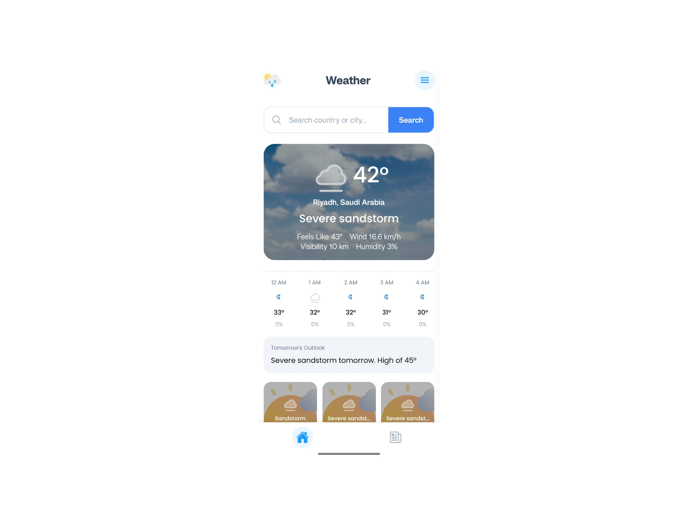

# SkyMF Weather App

SkyMF is a modern weather and news mobile application built with React Native and Expo.

The app provides real-time weather forecasts, hourly weather updates, multi-day forecasts, and trending news in a clean and responsive user interface with support for both Light and Dark modes.

---

## Features

- Real-time weather data
- Search weather by city name
- Hourly weather forecast
- Multi-day weather forecast
- Detailed weather information
- Trending news integration
- Dark / Light theme support
- Responsive mobile-first UI
- Sidebar navigation
- Social media integration
- OTA Updates using Expo Updates
- Persistent theme preference using AsyncStorage

---

## Preview

  
  

  
  

---

## Technologies Used

### Core

- React Native
- Expo SDK 54
- TypeScript

### Styling & UI

- NativeWind
- Expo Vector Icons
- Expo Linear Gradient

### Navigation

- React Navigation
- Bottom Tabs Navigation
- Native Stack Navigation

### Data & APIs

- Axios
- Weather API
- News API

### Storage

- AsyncStorage

### Performance & Native Features

- Expo Updates (OTA Updates)
- Expo Splash Screen
- Expo Status Bar
- React Native Reanimated
- React Native Safe Area Context
- React Native Screens

---

## Live Demo

Check out the live demo [here](https://mohamedfawzzi.vercel.app/).
